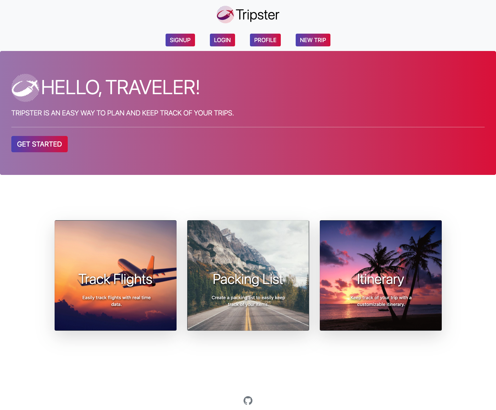

# Tripster


## Description

While there are many travel websites that address different aspects of a traveler’s needs, there's a need for an application that captures all of a traveller's plans and information in one place.

---

## Deployed Application

### https://tripster2021.herokuapp.com/

---

## GitHub Repository

### [Tripster](https://github.com/jtrevz/Tripster)


---

## Table of Contents

* [Installation](#installation)

* [Usage](#usage)

* [Technology](#technology)

* [Application Images](#Application-Images)

* [License](#license)

* [Contributing](#Contributing)

* [Questions](#Questions)

---

## Installation

If you wish to run your own copy of the application, please clone the repo and install the required node modules by running:

```
npm i
```
#### In addition, an installation of MongoDB is required.
---

## Usage

After installing the required npm modules and creating the database, the application can be started and run locally by entering:

```
npm start
```
from the command line.  

---

## Technology

The following technology was used to build note-taker:

  * [AeroDataBox](https://www.aerodatabox.com/)

  * [express.js](https://www.npmjs.com/package/express)

  * [Firebase](https://firebase.google.com/)

  * [jsPDF](https://www.npmjs.com/package/jspdf)

  * [MongoDB](https://www.mongodb.com/)

  * [Mongoose](https://www.npmjs.com/package/mongoose)

  * [node.js](https://nodejs.org/en/)

  * [react.js](https://www.npmjs.com/package/react)

  * [BootStrap v4.6](https://getbootstrap.com/docs/4.6/getting-started/introduction/)


---

## Application-Image


---


## License

[MIT License](https://opensource.org/licenses/MIT)

---

## Contributors

### Brian Bellanger
* BrianBellanger@gmail.com
* [GitHub](https://github.com/BrianBellanger)

### Ben Levin
* bensaebr@gmail.com
* [GitHub](https://github.com/Saebr)

### Jennifer Trevizo
* jenny.trevizo2013@gmail.com
* [GitHub](https://github.com/jtrevz)

#### Scott Wilrich 
* swillrich@gmail.com
* [GitHub](https://github.com/swillrich5)

---

## Questions

Any questions us? Message us on Github or email us at the addresses provided above!  Happy travelling!
